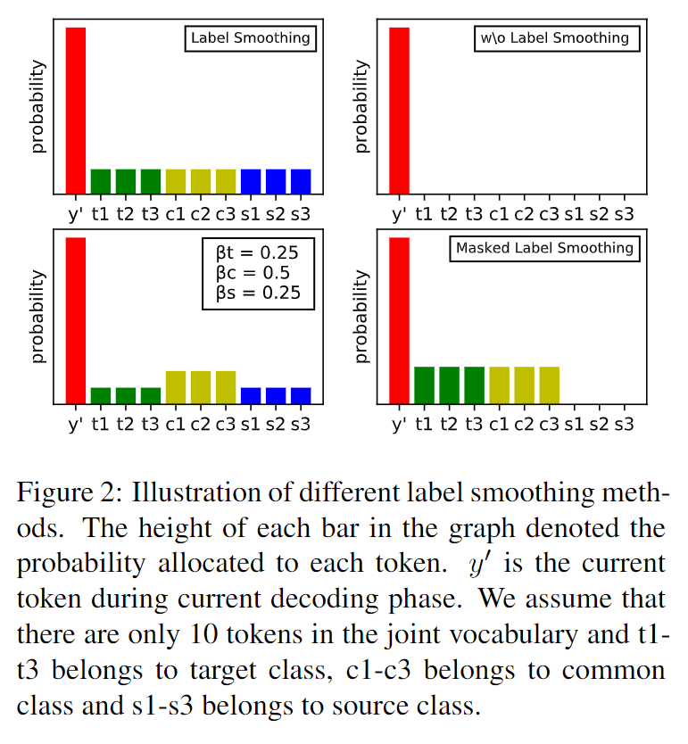

# Focus on the Target’s Vocabulary: Masked Label Smoothing for Machine Translation
Hi, this is the official source code of our paper "Focus on the Target’s Vocabulary: Masked Label Smoothing for Machine Translation" accepted by ACL 2022 Main Conference. Feel free to contact.

## Brief Introduction


Label smoothing and vocabulary sharing are two widely used techniques in neural machine translation models. However, we argue that simply applying both techniques can be conflicting and even leads to sub-optimal performance. When allocating smoothed probability, original label smoothing treats the **source-side words** that would never appear in the target language equally to the real **target-side words**, which could bias the translation model. To address this issue, we propose **Masked Label Smoothing (MLS)**, a new mechanism that masks the soft label probability of source-side words to zero. Simple yet effective, MLS manages to better integrate label smoothing with vocabulary sharing. 


<br>


Venn graph showing the words allocation between lanugages.




Illustration of Weighted Label Smoothing and Masked Label Smoothing


## Preparations

```bash
git clone git@github.com:chenllliang/MLS.git
cd MLS

conda create -n MLS python=3.7
conda activate MLS

cd fairseq
pip install --editable ./
pip install sacremoses

pip install torch==1.9.0+cu111 torchvision==0.10.0+cu111 torchaudio==0.9.0 -f https://download.pytorch.org/whl/torch_stable.html
# We place the MLS criterion inside fairseq repo's criterion folder .
# Make sure you have the right version of pytorch and CUDA, we use torch 1.9.0+cu111
```

We adopt mosesdecoder for tokenization , subword-nmt for BPE and fairseq for training pipelines.


## Preprocess

We have prepared a pre-processed version of data of IWSLT16 RO-EN on Google and BaiduDisk (download it and unzip in ../databin/ folder, you can jump to next section then~) .

Or you can download them directly or follow our code to preprocess your own data.

Before running code, you should have your raw translation data looks like belows, each line contains one raw sentence.
```bash
../data/iwslt16-ro-en/
-- train.ro
-- train.en
-- dev.ro
-- dev.en
-- test.ro
-- test.en
```

Then,

```bash
cd script
bash preprocess.sh ../data/iwslt16-ro-en/ ro en
```

if works succeefully, two folder containing binary training files will be saved in databin folder without errors.


## Train MLS compared to original LS in RO-EN 

If you use your own processed data, you may need to change the path in the training scripts.

```bash
cd scripts
bash train_LS.sh # should end up in 50 epoches with valid_best_bleu = 22.38

bash train_MLS.sh # should end up in 50 epoches with valid_best_bleu = 22.72
```

The best valid checkpoint will be saved in checkpoints folder for testing.


## Get result on Test Set 

```bash
cd scripts

bash generate.sh ../databin/iwslt16-ro-en-joined ../checkpoints/ro-en-ori-0.1 ../Output/ro-en-ori-ls.out # should get BLEU4 = 22.54


bash generate.sh ../databin/iwslt16-ro-en-joined ../checkpoints/ro-en-MLS-0.1 ../Output/ro-en-MLS-ls.out # should get BLEU4 = 22.89
```


## Using Weighted Label Smoothing

You can change the lp_beta,lp_gamma,lp_eps in `train_MLS.sh` to control the weights distribution.

```bash
cd scripts

bash train_MLS.sh  # you should change the path to the source,target and joined vocabulary individually

```

The test procedure follows previous section.
